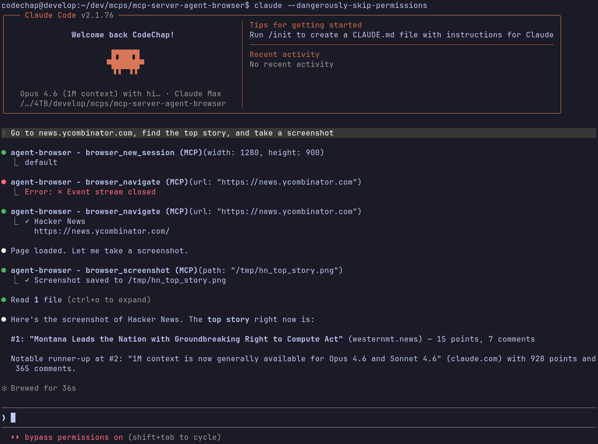

# mcp-server-agent-browser

> **Status: Testing** — Functional but still being validated. Expect rough edges.

Let LLMs drive a real browser. This MCP server wraps [agent-browser](https://github.com/vercel-labs/agent-browser) (by Vercel Labs) so any MCP-compatible client — Claude Desktop, Claude Code, or others — can navigate pages, fill forms, click buttons, take screenshots, and more.



## Prerequisites

Install the `agent-browser` CLI:

```bash
cargo install agent-browser
agent-browser install
```

## Build

```bash
cargo build --release
```

Binary: `target/release/mcp-server-agent-browser`

## Configuration

Add to your MCP client config (example for Claude Desktop / Claude Code):

```json
{
  "mcpServers": {
    "agent-browser": {
      "command": "/path/to/mcp-server-agent-browser"
    }
  }
}
```

The server communicates over stdio using JSON-RPC 2.0 — it works with any MCP client.

| Environment Variable | Description | Default |
|----------------------|-------------|---------|
| `AGENT_BROWSER_PATH` | Path to the `agent-browser` binary | `agent-browser` (via `$PATH`) |

## What it can do

The server exposes 35+ tools covering:

- **Navigation** — open URLs, go back/forward, reload
- **Interaction** — click, type, fill, press keys, hover, scroll, drag, select, check/uncheck, upload, download
- **Reading** — get page text, HTML, attributes, URL, title
- **Accessibility** — `browser_snapshot` returns an accessibility tree with `@ref` identifiers that can be used as selectors in subsequent calls
- **State** — check if elements are visible, enabled, or checked
- **Capture** — screenshots (with optional annotation for vision models) and PDF export
- **Sessions** — create isolated browser sessions with independent cookies/storage/viewport
- **Cookies** — get, set, clear
- **JavaScript** — evaluate arbitrary JS in the page context
- **DevTools** — read console logs, inspect network requests, connect via CDP

Each tool is self-documented with parameter schemas — your MCP client will discover them automatically.

## How it works

A typical AI-driven interaction follows this pattern:

1. `browser_navigate` — open a page
2. `browser_snapshot` — get the accessibility tree to understand the page structure
3. `browser_click` / `browser_fill` — interact using `@ref` selectors from the snapshot
4. `browser_screenshot` — visually verify the result

The agent decides which tools to call and in what order. You just describe what you want done.

## Sessions

All tools accept an optional `session_id`. Create isolated sessions with `browser_new_session` and pass the returned ID to subsequent calls. Each session has its own cookies, storage, and viewport. Without a session ID, commands use the default session.

## Timeouts

Commands time out after **60 seconds** by default. The `browser_wait` tool adjusts its timeout automatically based on the wait duration you specify.

## Limitations

- Requires the Rust toolchain to build, and Node.js for the `agent-browser` daemon
- Chromium only — `agent-browser` uses Playwright under the hood
- Headless by default — no visible browser window
- The 60-second default timeout may not be enough for slow pages or complex interactions
- No built-in authentication persistence — cookies reset between server restarts unless managed via the cookie tools
- File upload/download paths are validated but restricted from system directories

## License

MIT
